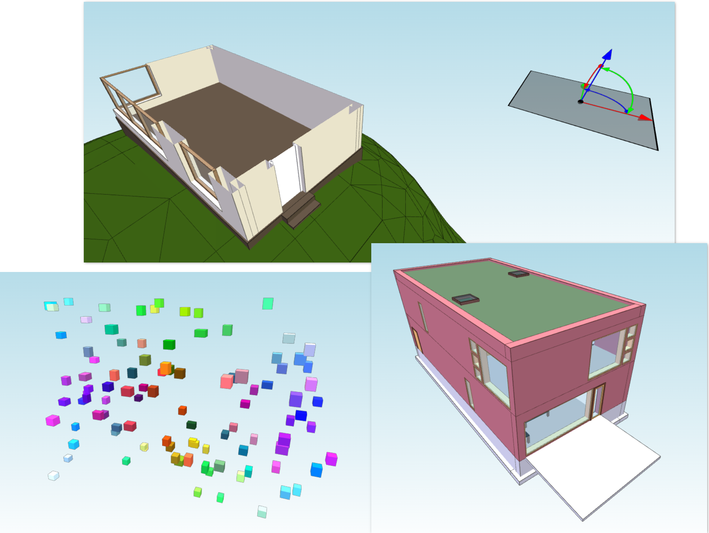

# xeopy = Xeokit + Python (Proof of concept, work in progress project)

## Description

xeopy is a library which allows to create Xeokit scenes using Python.

## Features

Right now you can control some things regarding:
- [x] Box
- [x] CameraSettings
- [x] WebIFCLoaderPlugin
- [x] Viewer
- [x] SectionPlanes
- [ ] SceneModel
- [ ] MetaModel

I'm open to hear suggestion regarding what should be added. Please open an issue here and let me know! :)

## Example files

You will find example files here: https://github.com/paireks/xeopy/tree/master/xeopy/tests/examples

## Unit tests

You can find and run unit tests inside the project here: https://github.com/paireks/xeopy/tree/master/xeopy/tests/unittests

## How it works

xeopy concept is really simple: underneath it creates an html file filled with JS code which uses Xeokit. Later you can open such html file and see the results.
