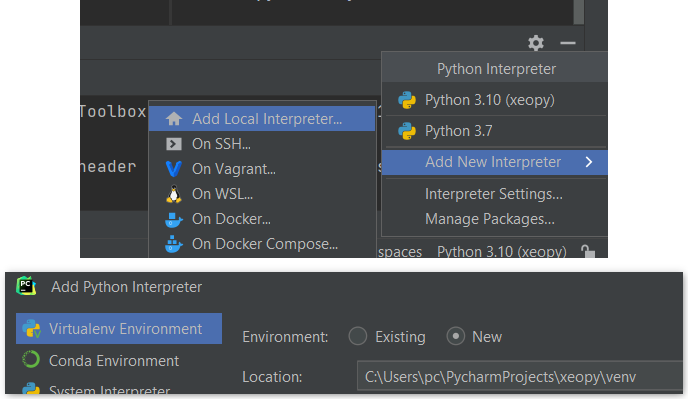
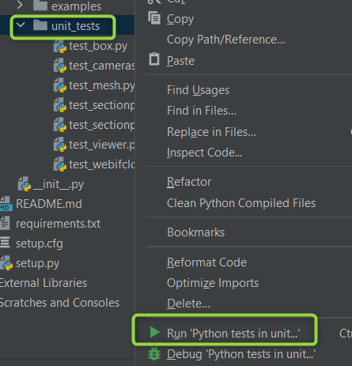

# xeopy = xeokit + Python (Work in progress project)

## Description

xeopy is a library which allows to create xeokit scenes using Python.

xeopy is fully written in Python.

It is currently a proof-of-concept prototype.

xeokit itself is a web programming toolkit for AEC graphics. Find more here: https://xeokit.io/

## Features

Right now you can control some things regarding:
- [x] Box
- [x] CameraSettings
- [x] WebIFCLoaderPlugin
- [x] Viewer
- [x] SectionPlanes
- [ ] SceneModel
- [ ] MetaModel

I'm open to hear suggestion regarding what should be added. Please open an issue here and let me know! :)

## Example files

You will find example files here: https://github.com/xeokit/xeopy/tree/master/xeopy/tests/examples

## How to run it

1. Clone this repository and configure Python interpreter
2. Run one of the example .py files -> it should generate html file
3. Run generated html file on localhost. Some IDEs (such as PyCharm) will let you do it with one click of a button (for PyCharm just open generated html file and click web-browser logo).

There is no yet PyPi package published, as it is a prototype.

## How it works

xeopy concept is really simple: underneath it creates an html file filled with JS code which uses Xeokit. Later you can open such html file and see the results.

## License

Find the license here: https://github.com/xeokit/xeopy/blob/master/LICENSE.md

## Development

### Setup

After clone it's good to create a venv (virtual environment).

In Pycharm you can do it like this:

### Unit tests

You can find and run unit tests inside the project here: https://github.com/xeokit/xeopy/tree/master/xeopy/tests/unit_tests

To run these tests you will also need to install pytest library.

In Pycharm you can run all the tests by right-clicking the unit_tests folder and clicking to run all tests.

You can also install coverage package to see code coverage.

In Pycharm it's Run -> Run 'Python tests in unit_tests' with Coverage
